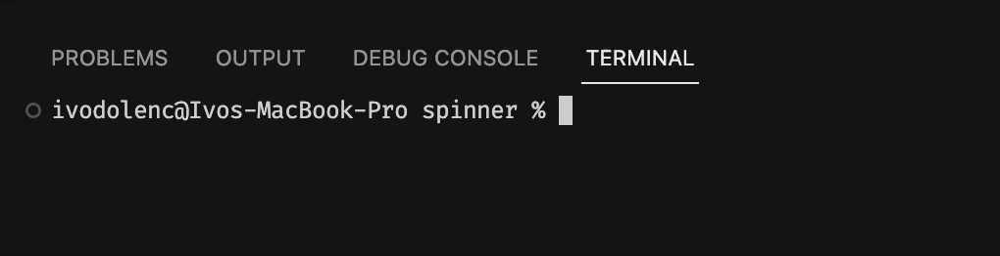

# @hypernym/spinner

A tiny and super customizable CLI spinner for Node.

<sub><a href="https://github.com/hypernym-studio/spinner">Repository</a> | <a href="https://www.npmjs.com/package/@hypernym/spinner">Package</a> | <a href="https://github.com/hypernym-studio/spinner/releases">Releases</a> | <a href="https://github.com/hypernym-studio/spinner/discussions">Discussions</a></sub>

```sh
npm i @hypernym/spinner
```

## Features

- TypeScript friendly
- Fully tree-shakeable
- No dependencies

## Usage

```ts
import { createSpinner } from '@hypernym/spinner'

const spinner = createSpinner()

spinner.start()

setTimeout(() => {
  spinner.update({
    message: 'Still loading...',
  })
}, 1000)

setTimeout(() => {
  spinner.update({
    message: 'Almost done...',
  })
}, 2000)

setTimeout(() => {
  spinner.stop()
}, 3000)
```

<p align="left">
  
</p>

## Methods

For all methods, each option is optional so you only need to specify what you want to change.

### .start()

Starts the spinner.

```ts
import { createSpinner } from '@hypernym/spinner'

const spinner = createSpinner()

spinner.start({
  message: 'Loading module...',
})
```

### .update()

Dynamically updates the spinner on the fly.

Very useful when you want to change the message or dynamics of other options before stopping the spinner.

```ts
import { createSpinner } from '@hypernym/spinner'

const spinner = createSpinner()

spinner.start()

setTimeout(() => {
  spinner.update({
    message: 'Still loading...',
  })
}, 1000)

setTimeout(() => {
  spinner.update({
    frames: ['-', '\\', '|', '/'],
    interval: 30,
    message: 'Almost done...',
  })
}, 2000)
```

### .stop()

Stops the spinner with a custom mark and message.

Also, use this method as _success_, _warning_, _cancel_, _error_ or similar events, since it is very customizable.

```ts
import { createSpinner } from '@hypernym/spinner'

const spinner = createSpinner()

spinner.start()

setTimeout(() => {
  spinner.stop({
    message: 'Module done!',
  })
}, 3000)
```

## Options

It's possible to specify _global_ options directly on the main spinner call. That way you don't have to define them for each method individually.

Also, all _global_ options are optional.

### frames

- Type: `string[]`
- Default: `['⠋', '⠙', '⠹', '⠸', '⠼', '⠴', '⠦', '⠧', '⠇', '⠏']`

Specifies the frames to be used in the spinner animation.

```ts
const spinner = createSpinner({
  frames: ['-', '\\', '|', '/'],
})
```

### interval

- Type: `number`
- Default: `40`

Specifies the time delay (in ms) between each frame.

```ts
const spinner = createSpinner({
  interval: 60,
})
```

### template

- Type: `function`
- Default: `undefined`

Defines the _line_ template.

Useful when you need to rearrange the position of the animation and message or change the template completely.

```ts
import { cyan } from '@hypernym/colors'

const spinner = createSpinner({
  template: (animation, message) => `${cyan(message)} ${cyan(animation)}`,
})
```

### start

- Type: `object`
- Default: `undefined`

Specifies global options for the `.start()` method.

```ts
const spinner = createSpinner({
  start: {
    message: 'Loading module...',
  },
})

spinner.start()
```

### stop

- Type: `object`
- Default: `undefined`

Specifies global options for the `.stop()` method.

```ts
import { cyan } from '@hypernym/colors'

const spinner = createSpinner({
  stop: {
    mark: cyan('✔'),
    message: 'Module done!',
    template: (mark, message) => `${message} ${mark}`,
  },
})

spinner.stop()
```

### cancel

- Type: `object`
- Default: `undefined`

Specifies global options for the Node `exit` event.

It's activated when the user explicitly cancels the process in the terminal (`ctrl` + `c`).

```ts
import { magenta } from '@hypernym/colors'

const spinner = createSpinner({
  cancel: {
    mark: magenta('✖'),
    message: 'Module cancelled!',
    template: (mark, message) => `${message} ${mark}`,
  },
})
```

## Community

Feel free to use the official [discussions](https://github.com/hypernym-studio/spinner/discussions) for any additional questions.

## License

Developed in 🇭🇷 Croatia

Released under the [MIT](LICENSE.txt) license.

© Hypernym Studio
